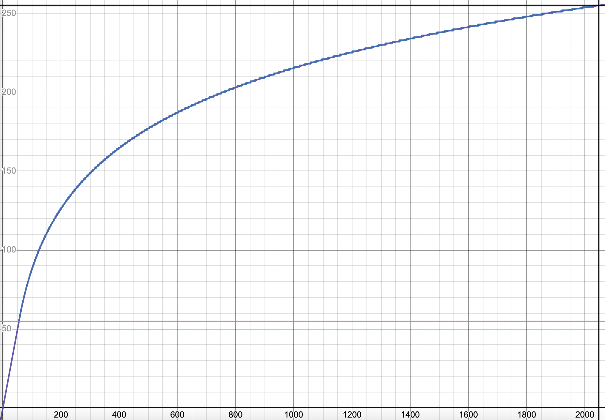

# Perfect Integer Quantization (PIQ)

### [Desmos Graphic](https://desmos.com/calculator/ssjp7pgkx4)

## Description

### Naive Approach

In order to keep error the same in all range, we need a function that will keep a relative
$y$ difference the same as $x$ difference. In other words, we need $f(x)$ that satisfies following formula:

$$ f(x) - f(kx) = f(y) - f(ky)  $$

The solution is $f(x) = \log_{k}(αx)+β$

### Another Approach

We need only integer values, but $\log(x)$ is bad for small values because $\log(2)≈\log(3)≈\log(4)≈\dots$.
So we lose a lot of numbers for the same small values.

The next idea to use $y=x$ for small values and $\log(x)$ for big values. It is better than naive approach,
but still is not perfect. In addition, this function has ugly jump in the middle.

### Perfect Approach (PIQ)

The final idea is next: we need to use $y=x$ until the $f(x+1)-f(x)=1$ and then switch to $f(x)$, where $f(x)=\log_{k}x+x_0$.
So we have next conditions:

$$
\begin{cases}
    f(x+1)-f(x)=1 \\
    a=f(a) \\
    b=f(s) \\
\end{cases}
$$

where
* $a$ is the point where we switch functions
* $b$ is the max value of source function (given)
* $s$ is the max value of target function (given)

The solution is:

$$
\begin{cases}
    a(1+\frac{1}{a})^{s-a}=b \text{ (solve for a)} \\
    k=1+\frac{1}{a} \\
    x_{0}=\log_{k}a-a \\
    f(x)=\{ x < a : x , \log_{k}x-x_{0} \}
\end{cases}
$$

* Purple-blue graph is *perfect* approach
* Red graph is *naive* and *another* approach

## Error

Error for _PIQ_ is $\frac{\left(b-a\right)}{b}\frac{k-1}{2}$%

Error for _Naive_ approach is $\frac{k_{naive}-1}{2}$% where $k_{naive}=\left(b+1\right)^{\frac{1}{s}}$

For $s=255$ and $b=2047$ the errors are ~1.8% and ~3% respectively.
The improvement is ~41%

## Quantization

The next step is to quantize the `uintX` into `uintY` using _PIQ_ and _Naive_ approach. 
See [Excel file](docs/compression.xlsx) for all results and details

Some results:

| source | destination | PIQ error  | Naive error | Improvement |
|--------|-------------|------------|-------------|-------------|
| 16     | 8           | 1.74%      | 2.22%       | 21.79%      |
| 32     | 8           | 4.22%      | 4.54%       | 7.10%       |
| 64     | 8           | 9.32%      | 9.50%       | 1.87%       |
| 32     | 16          | 0.01%      | 0.02%       | 33.35%      |
| 64     | 16          | 0.03%      | 0.03%       | 14.56%      |
| 128    | 16          | 0.06%      | 0.07%       | 6.40%       |
| 256    | 16          | 0.13%      | 0.14%       | 2.79%       |
| 64     | 32          | 0.0000003% | 0.0000005%  | 40.36%      |
| 128    | 32          | 0.0000008% | 0.0000010%  | 19.06%      |
| 256    | 32          | 0.0000019% | 0.0000021%  | 9.07%       |

### 8 bit

### 16 bit

### 32 bit

Use [main.py](main.py) to generate this values.
Note that 16 bit and 32 bit values need `np.longdouble` for calculations
